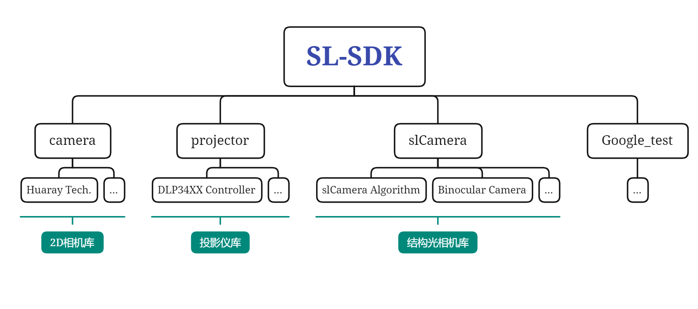
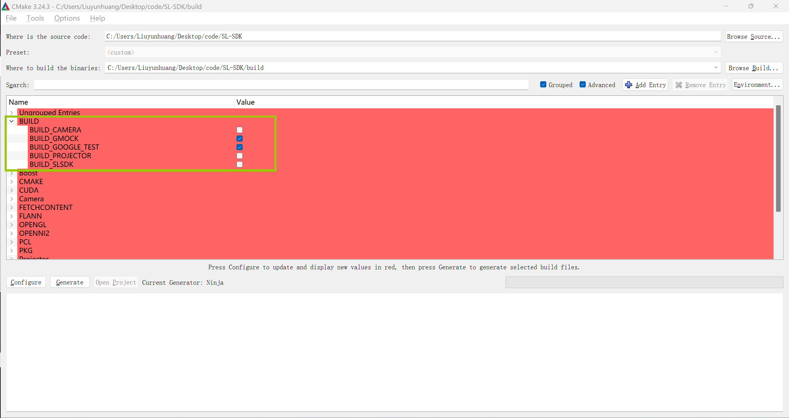
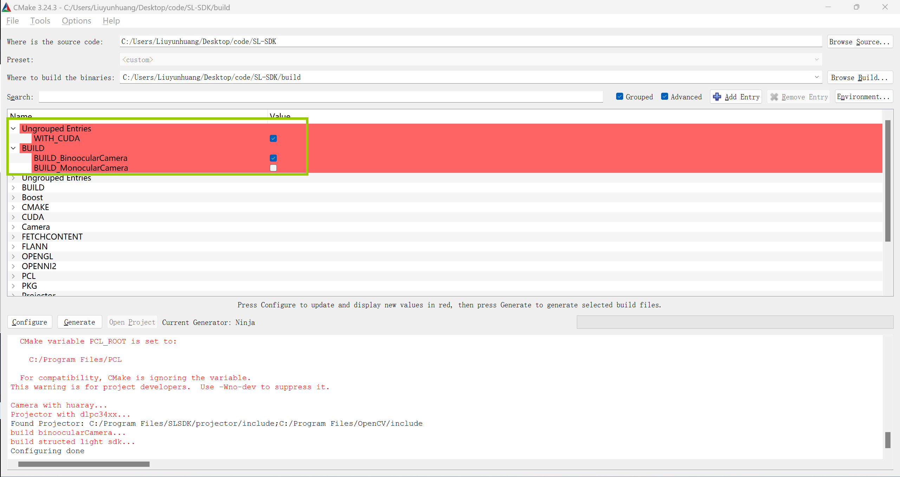

# 1. What is this?
本库为结构光相机库，内置2D相机、投影仪、3D结构光相机设备控制、结构光三维重建算法，总体库层次如下：


如有任何相关使用，请引用：
```
@Author: LiuYunhuang
@SofeWare: SL-SDK
@Data: 2023.6.25
```
# 2. How to get it?
### 1. CMake Cofigure选项
本软件可根据需要编译如第一节所述的模块，如下所示：

每一个模块都有对应的子模块选择，如`BUILD_SLSDK`下有子模块`WITH_CUDA`、`BUILD_BonoocularCamera`、`BUILD_MonocularCamera`。请根据需要，构造相应所需模块。

****************
### 2. 编译依赖
本软件各模块所依赖的库如下：
- `Camera` 模块
  - `OpenCV`
  - `MVSDK(华睿科技相机SDK)`
- `Projector` 模块
  - `OpenCV`
  - `CyUsbSerial`
  - `SetupApi`
- `slCamera` 模块
  - `Eigen3`
  - `OpenCV(-DWITH_CUDA: 带CUDA版本)`
  - `PCL`
  - `Camera`
  - `Projector`
  - `CUDA(-DWITH_CUDA)`
************
### 3. 编译顺序
注意到本库的`slCamera`模块依赖于`Camera`模块以及`Projector`模块，因此，首先需要先编译`Camera`和`Projector`模块，之后设置环境变量并编译`slCamera`模块。
> [Warning] 请注意任何模块库编译完成后请及时更新环境变量，本库仅提供CMake文件，而不提供`shell`程序以更新您的环境变量。
************
# 3. How to use it ?
### 1. 声明
> 本库都使用单例模式进行构建，单例工厂将根据您的需要返回唯一单例实例，这在设备中是必要的，因为任何硬件设备都不应该被多次构建及初始化。部分代码如投影仪，目前线程并不安全，多线程中请测试后反馈并重构线程安全代码。

> 由于`DLP34XX`系列控制芯片为`TI`公司消费级产品打造，后转至工业级应用场景，目前在线烧录图片尚存在偶尔烧录出错、不全等情况。此外，在`MSP430`单片机通讯时，请勿断开电源等一切破坏数据传输的操作，否则，请使用`MSP430`烧录器进行单片机程序烧录并更新固件。

> 本库的任何修改都应当遵守本库的架构设计，不符合本架构的额外代码请测试后再进行使用，任何代码的改动都应当进行`Google_test`测试后验证是否功能一致。
************
### 2. 示例
本库`Google_test`模块包含诸多测试代码以及测试数据，这也是一份非常具有参考价值的示例代码，您可根据需要配置它，并学习如何使用本库。